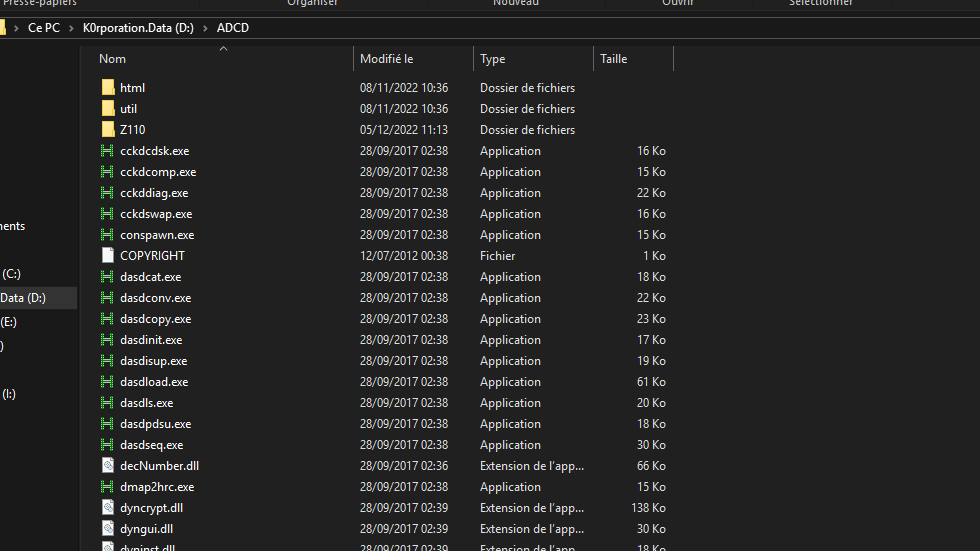
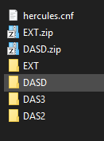
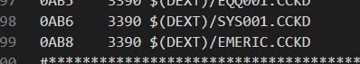
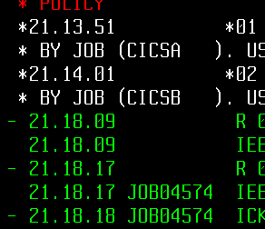

##


## 01 - Créé le CCKD

Pour créer le DASD sous format CCKD, il faut se rendre à la racine de votre programme Hercule : 



- Ici, vous lancer un terminal CMD.
- Ensuite vous entré la commande ```dasdinit -z <LE_NOM_DU_FICHIER_SUR_VOTRE_MACHINE>.CCKD 3390-3 <LE_NOM_DU_VOLUME_SOUS_ZOS_6_CHARA_MAX> 8000```
  - le z permet de compresser le fichier, vous aurez quelques ko au lieu de plusieurs Go, sympa!
  - 3390-3, c'est un disque 2.84 GB triple densité
  - 8000 pour 8000 cylindres
  - Je vous renvoie à [la documentation ](http://www.hercules-390.eu/hercload.html=) pour plus de détails
- Ensuite, rangé le avec tous les autres fichiers de votre système d'exploitation, pour ma part, j'ai plusieurs versions, donc je range ce genre de fichier EXTERNE dans un dossier EXT



## 02 -  Hercules

Du coup, puisque vous avez ajouter un fichier, il va aussi falloir l'ajouter dans votre fichier de configuration 'Hercules.cnf'



Faites bien attention à donner une addresse UNIQUE, suivi du format de fichier ( ici 3390, on l'a précisé dans l'initialisation )


## 03 - Console LCL700

Maintenant qu'on a tout parametré, on va passer aux choses serieuses donc avant tout, on va poser certaines choses pour que ce soit plus simple.

- IBMUSER: c'est votre identifiant ZOS
- TOTO: ce sera le nom du volume
- ABCD: Ce sera l'adresse UNIQUE que vous avez mis dans le hercules.cnf
- Vous avez fait un 8000 Cylindre (oui, je te vois au fond avec ton 99'000 cylindres)


On démarre Z/OS (ipl a80) puis dans le terminal 700 on va rentrer :
- ```V ABCD,OFFLINE``` pour déconnecté le volume
- ```S DEALLOC``` pour libérer le système (au cas où)

Voilà, on va pouvoir opérer

## 04 - Petit coup de JCL

Tant que le volume est déconnecté, on peut parametrer le système pour l'acceuillir, pour ça, on va lancer un JCL qui sera : 
```
//ICKDSF01 JOB  (FB3),'INIT 3390 DASD',CLASS=A,MSGCLASS=X,     
//             NOTIFY=&SYSUID,MSGLEVEL=(1,1)
//STEP01  EXEC PGM=ICKDSF,REGION=4096K
//SYSPRINT  DD SYSOUT=*
//SYSIN     DD *
//*
//STEP01  EXEC PGM=ICKDSF,REGION=4096K
//SYSPRINT  DD SYSOUT=*
//SYSIN     DD *
 INIT -
      NOVERIFY         -
      VTOC(0,1,450)    -
      UNITaddress(ABCD) -
      OWNERID(IBMUSER) -
      VOLID(TOTO)
//*
//
//*
```

Donc ici, remplacez bien les valeurs ABCD, IBMUSER, TOTO par vos informations respectivent.
Ce JCL va en fait mettre le volume a un état initial, simplement.
Historiquement, c'est une opération MECANIQUE, alors il va se passer quelque chose d'intéressant :
- Fait le ```SUB``` pour soumettre le JCL 
- Là, le terminal 700 va vous demander une réponse :  
  
  -   Ici en blanc, vous voyez *01 et *02
  -   Vous devrez regarder quel numéros il y a après l'asterisk
  -   Et répondre ```R <Numéros>,U```
  -   Donc dans mon cas :  ```R 01,U``` ou ```R 02,U```
- Et là, vous pourrez retourner sur votre terminal 701+, votre job sera fini!


## 05 - Retour au LCL700

OK, maintenant qu'on a initialisé notre volume, il nous reste à le monter!
Et pour cela, c'est très simple:
- Commencez par remettre en ligne votre volume : ```V ABCD,ONLINE```
- Puis montez le : ```M ABCD,VOL=(SL,TOTO),USE=PRIVATE```

Et voilà! Vous avez votre nouveau volume rien que pour vous! Idéal pour vos backups!